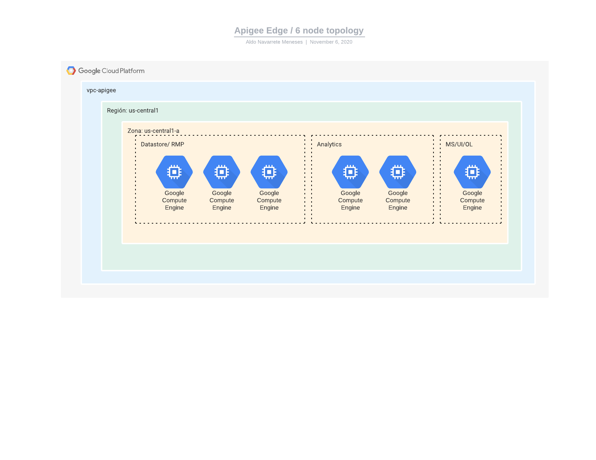
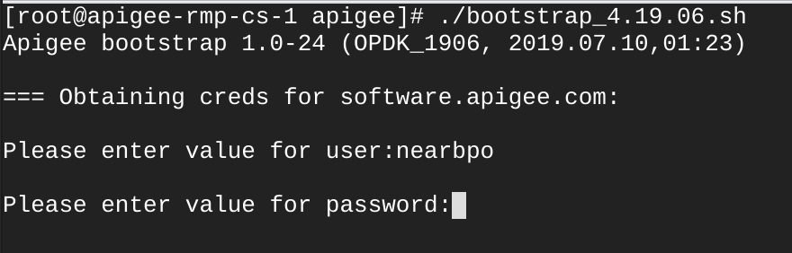
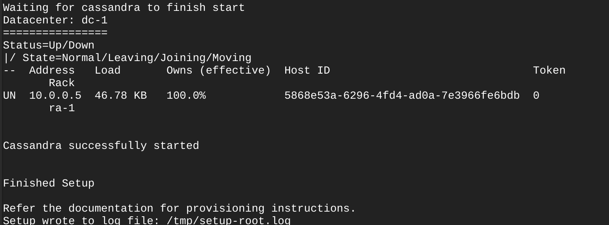
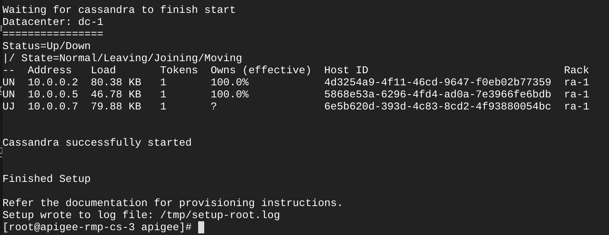
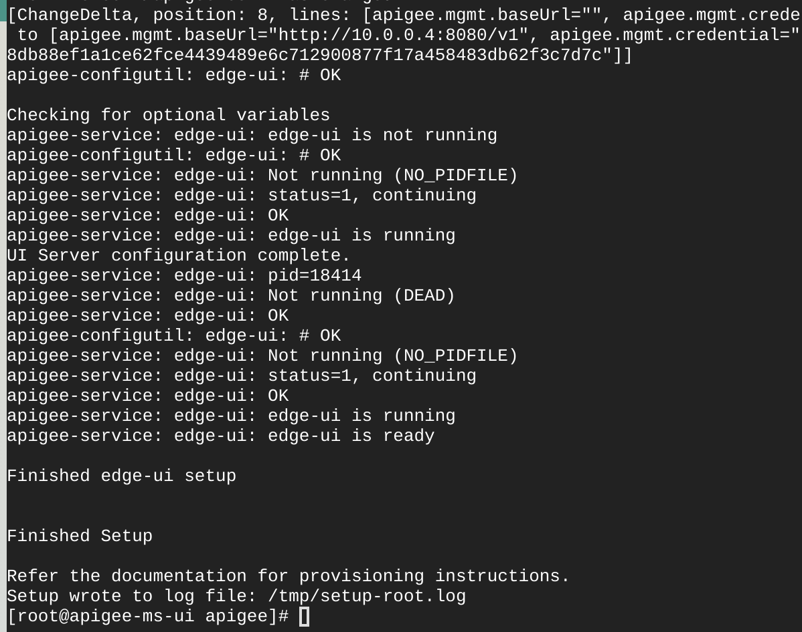
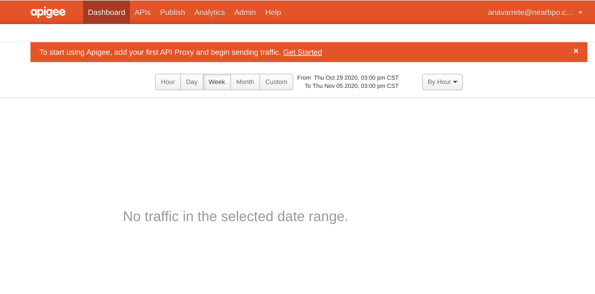
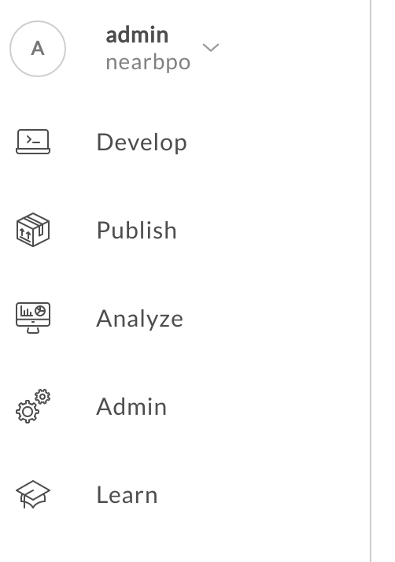
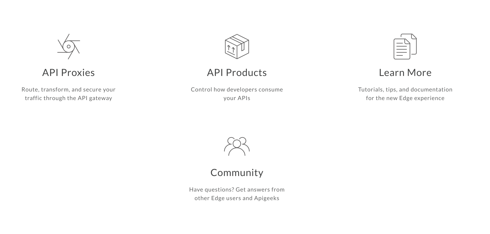

# Apigee Instalation in 5 nodes

**Index**
- [Apigee Instalation in 5 nodes](#apigee-instalation-in-5-nodes)
  - [Scope](#scope)
    - [Apigee Edge documentation](#apigee-edge-documentation)
  - [Topology](#topology)
  - [Prerequisites](#prerequisites)
    - [Topology ports](#topology-ports)
  - [Edge preparation steps](#edge-preparation-steps)
  - [Edge Installation](#edge-installation)
    - [Bootstrap](#bootstrap)
    - [Response file configuration](#response-file-configuration)
    - [Instalation for Cassandra & ZK](#instalation-for-cassandra--zk)
    - [Installation of Management Server](#installation-of-management-server)
    - [Installation of Router & Message Procesor (RMP)](#installation-of-router--message-procesor-rmp)
    - [Validate the Message Processor](#validate-the-message-processor)
    - [Installation of Analytics](#installation-of-analytics)
  - [Setup Organization](#setup-organization)
  - [Apigee Edge UI](#apigee-edge-ui)
  - [Install and configure Edge SSO](#install-and-configure-edge-sso)
    - [Create the TLS keys and certificates](#create-the-tls-keys-and-certificates)
  - [New Apigee UI Setup](#new-apigee-ui-setup)
    - [Prerequisites](#prerequisites-1)


## Scope

This document represents a collection of tailored instructions to install an Apigee Edge Planet. This document intends to covers all necessary steps, however it does not represent a replacement to the Apigee Edge Official Installation Guide. As applicable, please expand the information on this document by using the official documentation.

### Apigee Edge documentation

Apigee Edge Installation Guide: http://docs.apigee.com/private-cloud/latest/installing-edge-private-cloud

Apigee Edge Operations Guide: http://docs.apigee.com/private-cloud/latest/operations-and-configuration

## Topology



In a 6-node topology, three nodes run ZooKeeper and Cassandra clusters. Three of those three nodes also run Apigee Router and Message Processor. Two nodes run Apigee Analytics and one node to runs the Apigee Management Server, OpenLDAP, and Edge UI

---

## Prerequisites

### Topology ports


It is very important follow the next steps before to begin the installation process:

1. Validate: 
```
    hostname -i
```

2. Disable SELinux
```
    vim /etc/selinux/config
    Update the file: SELINUX=disabled
```

3. Disable Firewall
```
    systemctl stop firewall
```

4. Install wget command
```
    sudo yum install -y wget
```

5. Install curl command
```
    sudo yum install -y curl
```

6. Install LDAP Client only for some Apigee Edge versions
```
    sudo yum install -y openldap-clients openldap-servers
```

7. Install epel
```
    sudo wget https://dl.fedoraproject.org/pub/epel/epel-release-latest-7.noarch.rpm; rpm -ivh epel-release-latest-7.noarch.rpm
```

8. Install entropy
```
    sudo yum install -y rng-tools
```

9. Configure rngd.service
```
    sudo vim /usr/lib/systemd/system/rngd.service
```

    Replace this line:
```
        ExecStart=/sbin/rngd -f
```
    to:

```
        ExecStart=/sbin/rngd -f -r /dev/urandom
```

10. Run the following commands:
```
    systemctl daemon-reload
    systemctl start rngd
    systemctl status rngd
```

11. Install NSS
```
    sudo yum info nss
    sudo yum update nss
```

12. Install NTP
```
    sudo yum install ntp
```

13. Install Java
```
    sudo yum -y install java-1.8.0-openjdk-devel
```

14. Validate libdb-cxx
```
    yum install libdb-cxx
```

## Edge preparation steps

1. Create temporary working directory
   1. On all nodes, create a working directory
   ```
   mkdir /tmp/apigee
   ```
   2. Create a response file
   3. Copy response file to all nodes
   ```
   scp username@remotehost.com:/tmp/edge/edge-response-4.19.06-dc1.txt /tmp/edge
   ```
   4. Copy license file to all nodes
   ```
   scp username@remotehost.com:/tmp/edge/edge-response-4.19.06-dc1.txt /tmp/edge
   ```
---

## Edge Installation

### Bootstrap
Before to do the Instalation of Apigee Edge, is important download the bootstrap files and change the execution perssions, to do that you can use the following commands:

1. Download
```
    curl -O https://software.apigee.com/bootstrap_4.19.06.sh
```
2. Execution permissions
```
    chmod +x bootstrap_4.17.09.sh
```
3. Run the bootstrap like the image bellow



**It is very important get the username and password to install Apigee Edge**

4. Install the Edge apigee-service utility and dependencies
   On all nodes, run:

```
    /opt/apigee/apigee-service/bin/apigee-service apigee-setup install
```

### Response file configuration

It is important did a correct configuration of this file and keep the same file in all the instantances

### Instalation for Cassandra & ZK

1. Install Datastore cluster on nodes 1, 2 and 3:
Table

```
    /opt/apigee/apigee-setup/bin/setup.sh -p ds -f <configFile>
```

Result:



After to complete the installation of the three nodes, is very important validate the sync of all the Cassandra nodes



### Installation of Management Server

1. Install Management Server on node 6
```
    /opt/apigee/apigee-setup/bin/setup.sh -p ms -f <configFile>
```


### Installation of Router & Message Procesor (RMP)

1. Install Management Server on nodes 1, 2 and 3:
```
    /opt/apigee/apigee-setup/bin/setup.sh -p rmp -f <configFile>
```


### Validate the Message Processor
```
curl http://mp-ip:8082/v1/servers/self
```

### Installation of Analytics
1. Install Analytics on node 4 and 5
```
/opt/apigee/apigee-setup/bin/setup.sh -p sax -f <configFile>
```

2. Validate the Postgres Master with the following command:
```
    /opt/apigee/apigee-service/bin/apigee-service apigee-postgresql postgres-check-master
```
3. Validate the Postgres Slave with the following command:
```
    /opt/apigee/apigee-service/bin/apigee-service apigee-postgresql postgres-check-standby
```

---

## Setup Organization

1. Install provision on node 6 (Management Server), 
```
    /opt/apigee/apigee-service/bin/apigee-service apigee-provision install 
```

1. Use the setup-org command to create an organization
```
    /opt/apigee/apigee-service/bin/apigee-service apigee-provision setup-org -f <configFile>
```
1. Use the add-env command to create an environment
```
    /opt/apigee/apigee-service/bin/apigee-service apigee-provision add-env -f <configFile>
```

2. Validate Analytics
```
    psql -h /opt/apigee/var/run/apigee-postgresql -U apigee apigee
    \d analytics."nearbpo.dev.fact"
    select max(client_received_start_timestamp) from analytics."nearbpo.dev.fact";
    \q
```

```
    curl -u "userName" "http://10.0.0.4:8080/v1/o/nearbpo/e/dev/provisioning/axstatus"
```

---


## Apigee Edge UI
1. After to install the Organization is important restart the Apigee Edge UI
```
    /opt/apigee/apigee-service/bin/apigee-service edge-ui restart
```
2. Login on the Apige Edge UI



---

## Install and configure Edge SSO

Installing and configuring the Edge SSO module requires that you first generate two sets of TLS keys and certificates. The Edge SSO module uses TLS to secure the transmission of information as part of the SAML handshaking process with the SAML IDP.

**Note: By default, the Edge SSO module is accessible over HTTP on port 9099 of the node on which it is installed. You can enable TLS on the Edge SSO module. To do so, you have to create a third set of TLS keys and certificates used by Tomcat to support TLS**

### Create the TLS keys and certificates

The steps below create self-signed certs which might be fine for your testing environment but you typically require certs signed by a CA for a production environment.

To create the verification and signing key and self-signed cert

```
sudo mkdir -p /opt/apigee/customer/application/apigee-sso/jwt-keys

cd /opt/apigee/customer/application/apigee-sso/jwt-keys/

sudo openssl genrsa -out privkey.pem 2048

sudo openssl rsa -pubout -in privkey.pem -out pubkey.pem

sudo chown apigee:apigee *.pem

chmod 600 *.pem
```

```
/opt/apigee/apigee-setup/bin/setup.sh -p sso -f <configFile>
```


## New Apigee UI Setup

This document describes how to install the Edge UI for Apigee Edge for Private Cloud. The Edge UI is the next generation of UI for Edge.

### Prerequisites

To try out the new Edge UI in an Apigee Edge for Private Cloud installation, you must:

Install the Edge UI on its own node. You cannot install it on a node that contains other Edge components, including the node on which the existing Classic UI resides. Doing so will cause users to be unable to log in to the Classic UI.
The Edge UI's node must meet the following requirements:

- JAVA 1.8
- 4 GBytes of RAM
- 2-core
- 60GB disk space
- You must first install the 4.19.06 version of the **apigee-setup**
- Port 3001 must be open. This is the default port used for requests to the Edge UI. If you change the port by using the properties described in **New UE configuration file**, make sure that port is open
- Enable an external IDP on Edge. The Edge UI supports SAML or LDAP as the authentication mechanism.
- (SAML IDP only) The Edge UIonly supports TLS v1.2. Because you connect to the SAML IDP over TLS, if you use SAML, your IDP must therefore support TLS v1.2.


```
/opt/apigee/apigee-setup/bin/setup.sh -p ue -f <configFile>
```



---

