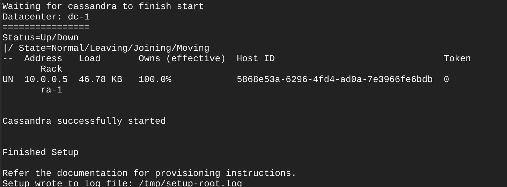
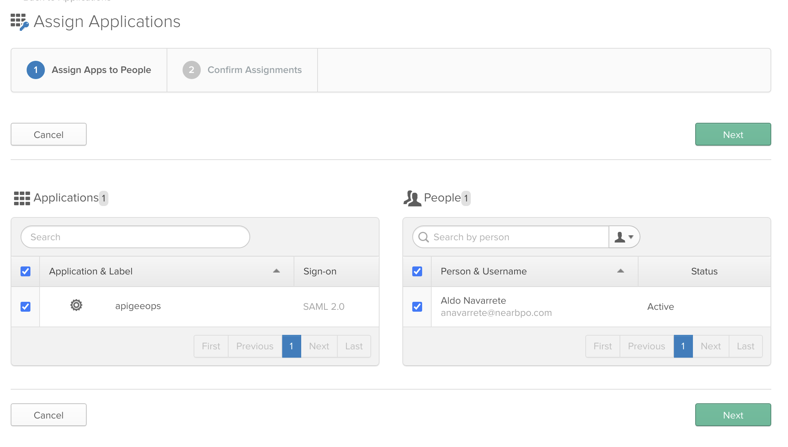

# Apigee Instalation in 6 nodes with OKTA

**Index**
- [Apigee Instalation in 6 nodes with OKTA](#apigee-instalation-in-6-nodes-with-okta)
  - [Scope](#scope)
    - [Apigee Edge documentation](#apigee-edge-documentation)
  - [Architecture](#architecture)
  - [Topology](#topology)
  - [Prerequisites](#prerequisites)
    - [Topology ports](#topology-ports)
  - [Edge preparation steps](#edge-preparation-steps)
  - [Edge Installation](#edge-installation)
    - [Bootstrap](#bootstrap)
    - [Response file configuration](#response-file-configuration)
    - [Instalation for Cassandra & ZK](#instalation-for-cassandra--zk)
    - [Installation of Management Server](#installation-of-management-server)
    - [Installation of Router & Message Procesor (RMP)](#installation-of-router--message-procesor-rmp)
    - [Validate the Message Processor](#validate-the-message-processor)
    - [Installation of Analytics](#installation-of-analytics)
  - [Setup Organization](#setup-organization)
  - [Apigee Edge UI](#apigee-edge-ui)
  - [OKTA](#okta)
    - [Setting Up a SAML Application](#setting-up-a-saml-application)
      - [General Settings](#general-settings)
      - [SAML Settings](#saml-settings)
      - [Feedback](#feedback)
      - [Sign on methods](#sign-on-methods)
      - [Assignments](#assignments)
  - [Install and configure Edge SSO](#install-and-configure-edge-sso)
    - [Create the TLS keys and certificates](#create-the-tls-keys-and-certificates)
    - [Install and configure Edge SSO for HTTP access](#install-and-configure-edge-sso-for-http-access)
    - [Enable SAML on the Edge UI](#enable-saml-on-the-edge-ui)


## Scope

This document represents a collection of tailored instructions to install an Apigee Edge Planet. This document intends to covers all necessary steps, however it does not represent a replacement to the Apigee Edge Official Installation Guide. As applicable, please expand the information on this document by using the official documentation.

### Apigee Edge documentation

Apigee Edge Installation Guide: http://docs.apigee.com/private-cloud/latest/installing-edge-private-cloud

Apigee Edge Operations Guide: http://docs.apigee.com/private-cloud/latest/operations-and-configuration

## Architecture


## Topology


In a 6-node topology, three nodes run ZooKeeper and Cassandra clusters. Three of those three nodes also run Apigee Router and Message Processor. Two nodes run Apigee Analytics and one node to runs the Apigee Management Server, OpenLDAP, and Edge UI

---

## Prerequisites

### Topology ports


It is very important follow the next steps before to begin the installation process: **Login as root user**

1. Validate: 
```
    hostname -i
```

2. Disable SELinux
```
    vim /etc/selinux/config
    Update the file: SELINUX=disabled
```

3. Disable Firewall
```
    systemctl stop firewall
```

4. Install wget command
```
    sudo yum install -y wget
```

5. Install curl command
```
    sudo yum install -y curl
```

6. Install LDAP Client only for some Apigee Edge versions
```
    sudo yum install -y openldap-clients openldap-servers
```

7. Install epel
```
    sudo wget https://dl.fedoraproject.org/pub/epel/epel-release-latest-7.noarch.rpm; rpm -ivh epel-release-latest-7.noarch.rpm
```

8. Install entropy
```
    sudo yum install -y rng-tools
```

9. Configure rngd.service
```
    sudo vim /usr/lib/systemd/system/rngd.service
```

    Replace this line:
```
        ExecStart=/sbin/rngd -f
```
    to:

```
        ExecStart=/sbin/rngd -f -r /dev/urandom
```

10. Run the following commands:
```
    systemctl daemon-reload
    systemctl start rngd
    systemctl status rngd
```

11. Install NSS
```
    sudo yum info nss
    sudo yum update nss
```

12. Install NTP
```
    sudo yum install ntp
```

13. Install Java
```
    sudo yum -y install java-1.8.0-openjdk-devel
```

14. Validate libdb-cxx
```
    yum install libdb-cxx
```

## Edge preparation steps

1. Create temporary working directory
   1. On all nodes, create a working directory
   ```
   mkdir /tmp/apigee
   ```
   2. Create a response file
   3. Copy response file to all nodes
   ```
   scp username@remotehost.com:/tmp/edge/edge-response-4.19.06-dc1.txt /tmp/edge
   ```
   4. Copy license file to all nodes
   ```
   scp username@remotehost.com:/tmp/edge/edge-response-4.19.06-dc1.txt /tmp/edge
   ```
---

## Edge Installation

### Bootstrap
Before to do the Instalation of Apigee Edge, is important download the bootstrap files and change the execution perssions, to do that you can use the following commands:

1. Download
```
    curl -O https://software.apigee.com/bootstrap_4.19.06.sh
```
2. Execution permissions
```
    chmod +x bootstrap_4.17.09.sh
```
3. Run the bootstrap like the image bellow


**It is very important get the username and password to install Apigee Edge**

4. Install the Edge apigee-service utility and dependencies
   On all nodes, run:

```
    /opt/apigee/apigee-service/bin/apigee-service apigee-setup install
```

### Response file configuration

It is important did a correct configuration of this file and keep the same file in all the instantances

### Instalation for Cassandra & ZK

1. Install Datastore cluster on nodes 1, 2 and 3:
Table

```
    /opt/apigee/apigee-setup/bin/setup.sh -p ds -f <configFile>
```

Result:



After to complete the installation of the three nodes, is very important validate the sync of all the Cassandra nodes


### Installation of Management Server

1. Install Management Server on node 6
```
    /opt/apigee/apigee-setup/bin/setup.sh -p ms -f <configFile>
```


### Installation of Router & Message Procesor (RMP)

1. Install Router and Message Processor Server on nodes 1, 2 and 3:
```
    /opt/apigee/apigee-setup/bin/setup.sh -p rmp -f <configFile>
```


### Validate the Message Processor
```
curl http://mp-ip:8082/v1/servers/self
```

### Installation of Analytics
1. Install Analytics on node 4 and 5
```
/opt/apigee/apigee-setup/bin/setup.sh -p sax -f <configFile>
```

2. Validate the Postgres Master with the following command:
```
    /opt/apigee/apigee-service/bin/apigee-service apigee-postgresql postgres-check-master
```
3. Validate the Postgres Slave with the following command:
```
    /opt/apigee/apigee-service/bin/apigee-service apigee-postgresql postgres-check-standby
```

---

## Setup Organization

1. Install provision on node 6 (Management Server), 
```
    /opt/apigee/apigee-service/bin/apigee-service apigee-provision install 
```

1. Use the setup-org command to create an organization
```
    /opt/apigee/apigee-service/bin/apigee-service apigee-provision setup-org -f <configFile>
```
1. Use the add-env command to create an environment
```
    /opt/apigee/apigee-service/bin/apigee-service apigee-provision add-env -f <configFile>
```

2. Validate Analytics
```
    psql -h /opt/apigee/var/run/apigee-postgresql -U apigee apigee
    \d analytics."nearbpo.dev.fact"
    select max(client_received_start_timestamp) from analytics."nearbpo.dev.fact";
    \q
```

```
    curl -u "userName" "http://10.0.0.4:8080/v1/o/nearbpo/e/dev/provisioning/axstatus"
```

---


## Apigee Edge UI
1. After to install the Organization is important restart the Apigee Edge UI
```
    /opt/apigee/apigee-service/bin/apigee-service edge-ui restart
```
2. Login on the Apige Edge UI


---

## OKTA

### Setting Up a SAML Application 

The first step in configuring an application to support SAML based Single Sign-On from Okta is to set up an application in Okta.

Log in to your Okta organization as a user with administrative privileges. 

Click on the blue "Admin" button Admin


Click on the "Add Applications" shortcut Add Applications
   
Click on the green "Create New App" button Create New App
   


For Platform select “Web” if is not already selected.
   
In the dialog that opens, select the "SAML 2.0" option, then click the green "Create" button Create a New Application Integration


#### General Settings
Step 1 "General Settings"
Enter some name for the app  in the "App name" field (e.g. “Apigee App”), then click the green "Next" button. 
Optionally you could provide a new logo for the app. This logo be used to display the app in the Home page for the users.
Check the box “Do not display application icon in the Okta Mobile app”.


#### SAML Settings

Step 2 "Configure SAML”

In section A "SAML Settings", put the Apigee SSO URL into the "Single sign on URL" field
In the field "Audience URI (SP Entity ID)" a unique string is needed
The string can something like “zoneName.apigee-saml-login”.
In the field “Name ID format” select the option “EmailAddress”.
In the field “Application username” the option “Okta username” should be selected.
There is no need to change anything inside “Show Advanced Settings” now.
In the "Attribute Statements" section, add three attribute statements:
Write "FirstName" and set it to "user.firstName"
Write "LastName" and set it to "user.lastName"
Write "Email" and set it to "user.email"
Click Next to continue.


#### Feedback
Select "I'm an Okta customer adding an internal app", and "This is an internal app that we have created," then click Finish.


#### Sign on methods
The "Sign On" section of your newly created application appears. Keep this page open it a separate tab or browser window. You will return to this page later in this guide and copy the "Identity Provider metadata" link. (To copy that link, right-click on the "Identity Provider metadata" link and select "Copy").

Find the box with the yellow bar and click on the “Identity Provider metadata” link, this will open the metadata needed for Apigee. Copy the URL to send it in the ticket to Apigee Support. 


#### Assignments
On the "Assignments" section of the application the user on the organization that will have access to Apigee will be assigned.

Click on the "Assign" button, you can select "Assign to People" or “Assign to Groups”.

A dialog will open. Select the "Assign" button next to the username/group.

if “Assign to People” was selected, verify the user-specific attributes, then select "Save and Go Back". 

Click "Done" to exit the assignment wizard.


---

## Install and configure Edge SSO

Installing and configuring the Edge SSO module requires that you first generate two sets of TLS keys and certificates. The Edge SSO module uses TLS to secure the transmission of information as part of the SAML handshaking process with the SAML IDP.

**Note: By default, the Edge SSO module is accessible over HTTP on port 9099 of the node on which it is installed. You can enable TLS on the Edge SSO module. To do so, you have to create a third set of TLS keys and certificates used by Tomcat to support TLS**

### Create the TLS keys and certificates

The steps below create self-signed certs which might be fine for your testing environment but you typically require certs signed by a CA for a production environment.

To create the verification and signing key and self-signed cert:
```
sudo mkdir -p /opt/apigee/customer/application/apigee-sso/jwt-keys
cd /opt/apigee/customer/application/apigee-sso/jwt-keys/
sudo openssl genrsa -out privkey.pem 2048
sudo openssl rsa -pubout -in privkey.pem -out pubkey.pem
sudo chown apigee:apigee *.pem
```

To create the key and self-signed cert, with no passphrase, for communicating with the SAML IDP:

```
sudo mkdir -p /opt/apigee/customer/application/apigee-sso/saml/
cd /opt/apigee/customer/application/apigee-sso/saml/
```

Generate your private key with a passphrase
```
sudo openssl genrsa -aes256 -out server.key 1024
```

Remove the passphrase from the key:
```
cd /opt/apigee/customer/application/apigee-sso/saml/
```

Generate certificate signing request for CA
```
sudo openssl req -x509 -sha256 -new -key server.key -out server.csr
```

Generate self-signed certificate with 365 days expiry-time
```
sudo openssl x509 -sha256 -days 365 -in server.csr -signkey server.key -out selfsigned.crt
sudo chown apigee:apigee server.key
sudo chown apigee:apigee selfsigned.crt
```

### Install and configure Edge SSO for HTTP access
To install the Edge SSO module, apigee-sso, you must use the same process that you used to install Edge. Because apigee-sso is represented by an RPM file, that means the user performing the install must be the root user or be a user that has full sudo access.

See the config file [here](sso.cfg)

To install the Edge SSO module:
Log in to the Management Server node. That node should already have apigee-service installed as described at Install the Edge apigee-setup utility.
Note that you can install Edge SSO on a different node. However, that node must be able to access the Management Server over port 8080.

Instal and configure apigee-sso:

```
/opt/apigee/apigee-setup/bin/setup.sh -p sso -f <configFile>
```

Install the apigee-ssoadminapi.sh utility used to manage admin and machine users for the apigee-sso module:

```
/opt/apigee/apigee-service/bin/apigee-service apigee-ssoadminapi install
```

### Enable SAML on the Edge UI
After installing the Edge SSO module, you have to configure the Edge UI to supports SAML. The Edge UI is typically installed on the same node as the Edge Management Server, meaning it s on the same node as apigee-sso.

After you enable SAML on the Edge UI, the Edge UI uses OAuth to connect to the Management Server. You do not have to worry about expiring OAuth tokens between the Edge UI and the Edge Management Server. Expired tokens are automatically refreshed.

See the config file [here](sso-setup.cfg)

```
/opt/apigee/apigee-service/bin/apigee-service edge-ui configure-sso -f <configFile>
```